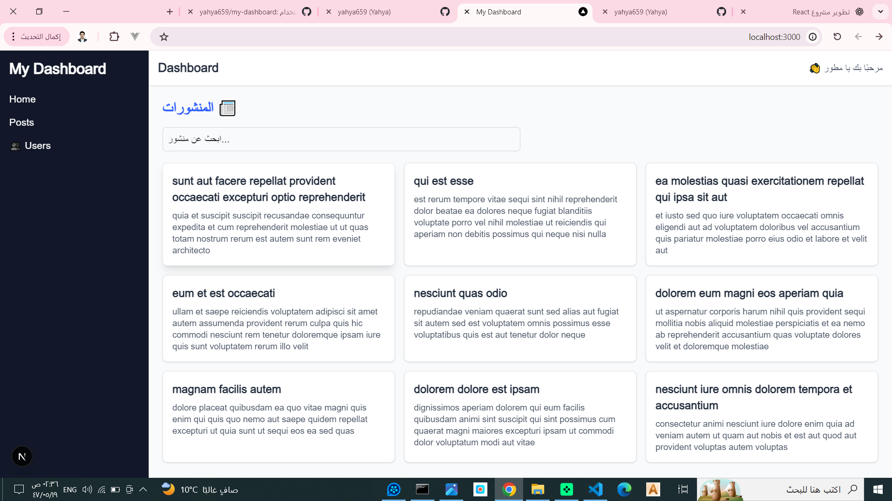

<h1 align="center">🧭 My Dashboard رابط المشروعhttps://my-dashboard-three-lyart.vercel.app/</h1>

<p align="center">
لوحة تحكم احترافية مبنية باستخدام <b>Next.js + React + TypeScript</b><br>
لتنظيم وإدارة المستخدمين والمنشورات بسهولة وسرعة ⚡
</p>

<p align="center">
  
  
  
  
</p>

---

## 🚀 الميزات الرئيسية

- ✅ واجهة مستخدم حديثة وسريعة الاستجابة (Responsive)
- ⚙️ نظام صفحات ديناميكي باستخدام Next.js App Router
- 🧩 مكونات قابلة لإعادة الاستخدام (Reusable Components)
- 🌐 جلب بيانات من واجهات API
- 💡 كتابة منظمة ومحسّنة بـ TypeScript
- 🪄 تصميم باستخدام Tailwind CSS

---

## 🧠 التقنيات المستخدمة

| التقنية | الاستخدام |
|----------|------------|
| **Next.js 14** | بناء المشروع وتنظيم الصفحات |
| **React 18** | المكونات والواجهة التفاعلية |
| **TypeScript** | كتابة قوية وآمنة للبيانات |
| **Tailwind CSS** | تصميم الواجهة بسرعة |
| **Node.js** | تشغيل بيئة التطوير |
| **Git & GitHub** | إدارة الإصدارات والتعاون |

---

## 💻 التشغيل المحلي

```bash
# تثبيت الحزم
npm install

# تشغيل المشروع محليًا
npm run dev
